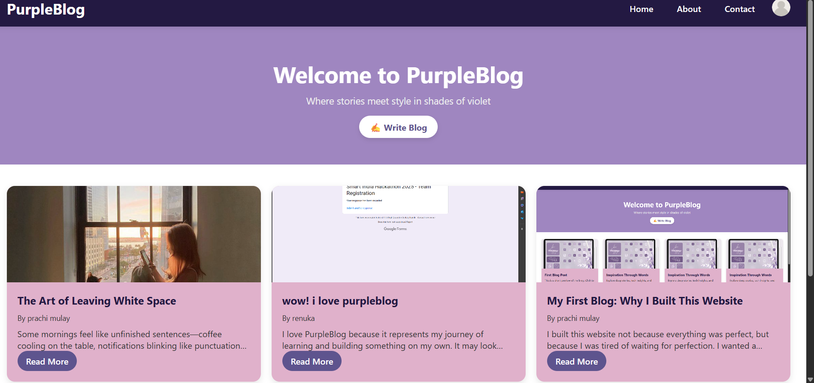
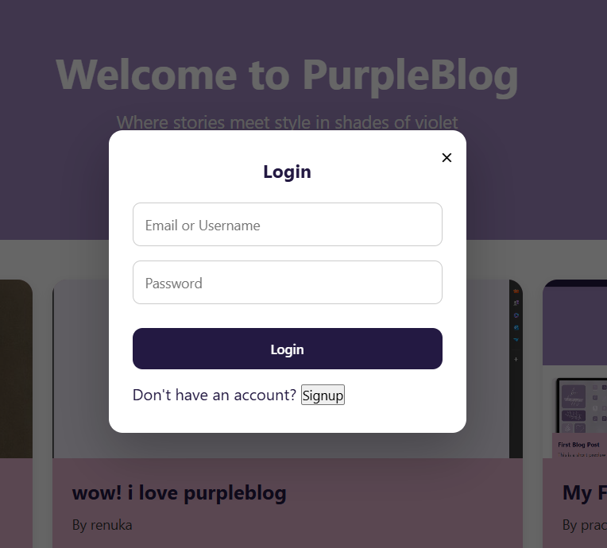
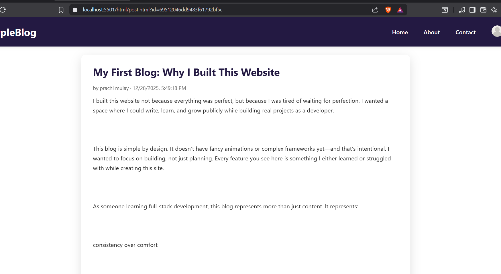
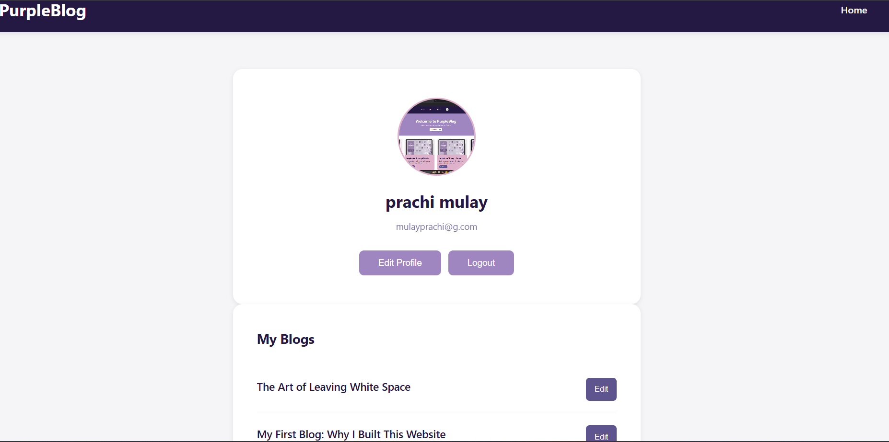

# 📝 PurpleBlog — Full Stack Blog Website

PurpleBlog is a full-stack blog application built to understand how real-world web applications work end-to-end — from user authentication to database operations and media uploads.

This project focuses on **clean backend logic, secure authentication, and a simple, usable UI**, rather than just visuals.

---

## 🚀 Features

### 🔐 Authentication
- User registration & login  
- Secure password hashing  
- JWT-based authentication (Access & Refresh tokens)  
- Protected routes  

### ✍️ Blog Management
- Create, edit, delete blog posts  
- Fetch all blogs  
- Author-specific operations  

### 🖼️ Media Uploads
- Image upload support using Cloudinary  

### ⚙️ Backend Architecture
- RESTful APIs  
- Modular folder structure  
- Centralized error handling  
- Environment-based configuration  

---

## 🛠️ Tech Stack

### Frontend
- HTML  
- CSS  
- JavaScript (Vanilla)  

### Backend
- Node.js  
- Express.js  

### Database
- MongoDB (Mongoose)  

### Other Tools & Services
- Cloudinary (image uploads)  
- JWT (authentication)  
- dotenv (environment variables)  
- Nodemon (development)  

---

## ⚙️ How to Run Locally

### Prerequisites
- Node.js installed  
- MongoDB (local or Atlas)  
- Cloudinary account  

---

### 1️⃣ Clone the repository
```bash
git clone https://github.com/prachimulay17/blog-website.git
cd blog-website


### 2️⃣ Install dependencies
```bash
npm install
```

### 3️⃣ Create a .env file
```env
PORT=8000
MONGODB_URI=your_mongodb_uri

ACCESS_TOKEN_SECRET=your_access_token_secret
REFRESH_TOKEN_SECRET=your_refresh_token_secret

CLOUDINARY_CLOUD_NAME=your_cloud_name
CLOUDINARY_API_KEY=your_api_key
CLOUDINARY_API_SECRET=your_api_secret
```

### 4️⃣ Start the development server
```bash
npm run dev
```

### 5️⃣ Open in browser
```text
http://localhost:8000
```

---

### 🔐 API Endpoints

Authentication  
Method    Endpoint                Description  
POST      /api/users/register     Register a new user  
POST      /api/users/login        Login user  
POST      /api/users/logout       Logout user  

Blogs  
Method    Endpoint                Description  
POST      /api/posts              Create a blog  
GET       /api/posts              Get all blogs  
PUT       /api/posts/:id          Update blog  
DELETE    /api/posts/:id          Delete blog  

---

### 📌 Project Status
- ✅ Core backend completed
- ✅ Authentication implemented
- 🛠️ UI & features improving
- 🚀 Deployment planned

---

## 📸 Screenshots

### Home Page


### Login Page


### Read Blog


### Profile Page


---

### 🧠 What I Learned
- How authentication works in real applications
- Structuring backend code for scalability
- Handling file uploads securely
- Writing clean REST APIs
- Connecting frontend & backend without frameworks

---

### 🔮 Future Improvements
- Comments & likes on blogs
- User profile editing
- Pagination & search
- Deployment with CI/CD
- Frontend framework (React)
```
